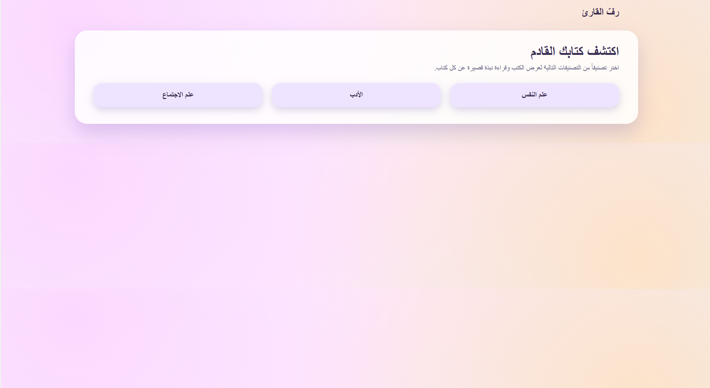
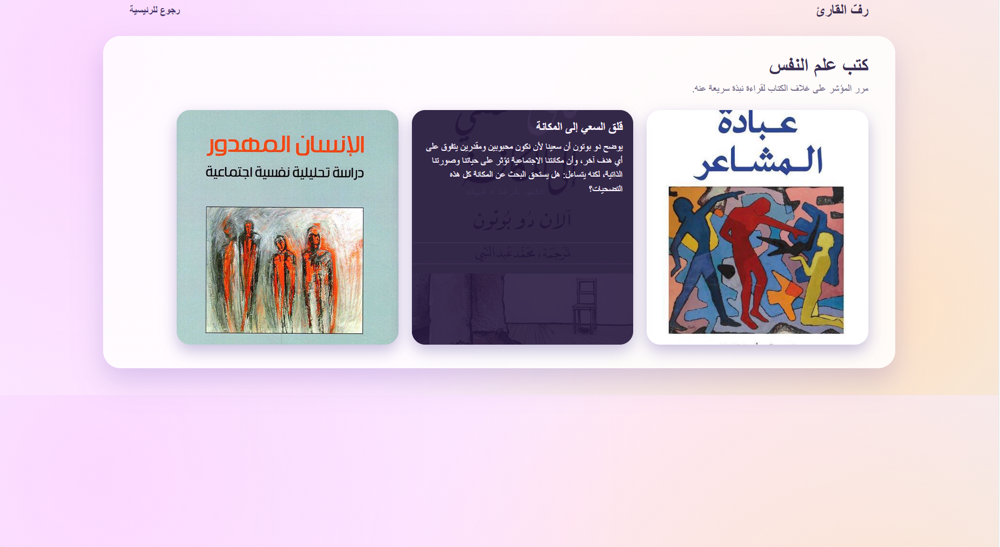
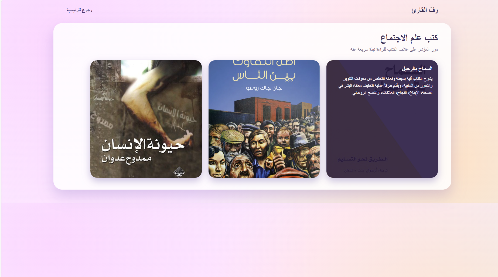

# Reader’s Shelf – Book Discovery Website

A responsive educational website developed using HTML, CSS, and JavaScript. The website showcases books from different categories and provides users with a simple and organized browsing experience.

## Features
- Home page
- Psychology section
- Literature section
- Sociology section
- Responsive and user-friendly interface
- Easy navigation between book categories

## Technologies Used
- HTML
- CSS
- JavaScript

## How to Run
1. Download or clone the repository.
2. Open the project folder.
3. Run index.html in your web browser.

## Screenshots

### Home Page

### Psychology Page

### Literature Page

### Sociology Page

